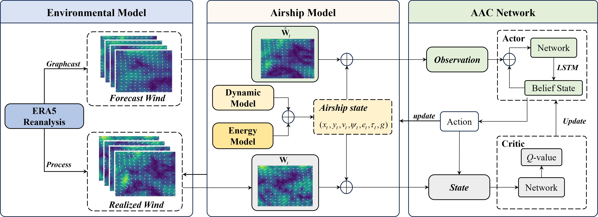
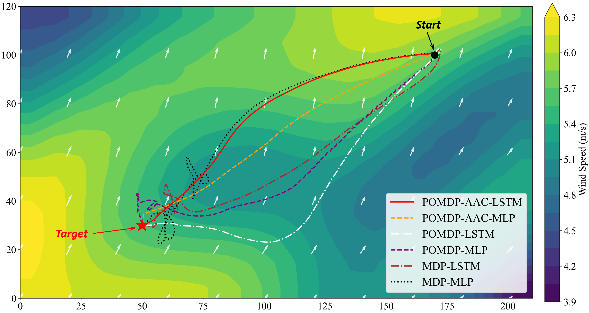
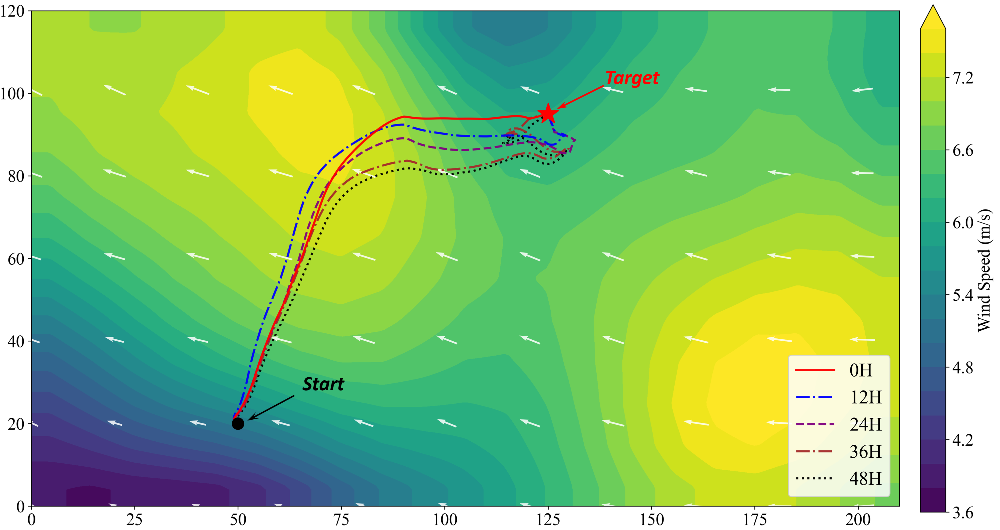

# Supplementary Visualizations for the Paper

This repository hosts **supplementary trajectory visualizations** (GIF/PNG) accompanying our paper on long-horizon stratospheric airship trajectory planning under forecast-uncertain wind fields.

> **Paper:** *Trajectory Planning for Stratospheric Airship under Forecast-Uncertain Wind Fields via Asymmetric Actor-Critic Reinforcement Learning*.  
> **Method:** *[POMDP + Asymmetric Actor–Critic + LSTM]*  
> **Framework:** 

---

## What’s Inside

- **Trajectory animations (GIF):** qualitative comparisons across methods, lead times, and OOD settings.
- **High-resolution figures (PNG):** publication-ready visuals for the paper appendix/supplement.

This repository is intentionally **minimal** and focuses on *visual evidence* rather than full training code.

---

## Quick Preview

### Key Trajectory Comparisons

**Algorithms**  


**Lead-time sweep (0–48h)**  


### Resources
- [Baidu Netdisk](https://pan.baidu.com/s/1GqGTO1JKbIb7IBay1W8MkQ?pwd=2y6x) - Download the visual animated **GIF**： *(Extraction Code: 2y6x)*

---

## 🌦️ GraphCast Forecasts

### Description
**GraphCast** is a learning-based global weather forecasting model developed by Google DeepMind. In our paper, GraphCast forecasts are used as the **deployment-available meteorological input** (i.e., forecast winds) to characterize forecast uncertainty and support forecast-driven decision making.

### Resources
- [Official GitHub Repository](https://github.com/google-deepmind/graphcast)

### Note
This repository does **not** redistribute GraphCast model weights or datasets. Please follow the official GraphCast repository and its license/terms for installation and usage.

---

## 📊 ERA5 Dataset

### Description
The **ERA5 Dataset** from the European Centre for Medium-Range Weather Forecasts provides global historical atmosphere data at high spatial and temporal resolution. It provides data related to wind fields, serving as the backbone for training the RL model.

### Resources
- [Official Website](https://cds.climate.copernicus.eu/datasets/reanalysis-era5-pressure-levels?tab=download)

---

## 📄 License

### CMEMS Dataset
The use of this dataset is distributed under the **CC-BY licence**. Commercial use of these models is strictly prohibited.

For more details, please refer to the [license terms](https://creativecommons.org/licenses/by/4.0/legalcode).

### Custom Models
Unless otherwise stated, all custom models and tools provided in this repository are released under the **MIT License** for non-commercial research purposes.

---

## 📚 Citation

If you use any of the models or datasets in your research, please cite the following works:

### ERA5 Dataset:
```bibtex
@misc{ecmwf2024hres,
  author = {{European Centre for Medium-Range Weather Forecast Forecasts}},
  title  = {High-Resolution Operational Forecast (HRES), Set I},
  year   = {2024},
  note   = {Accessed: 2024-05-20},
  url    = {https://www.ecmwf.int/en/forecasts/datasets/set-i},
  institution = {ECMWF},
  ad
